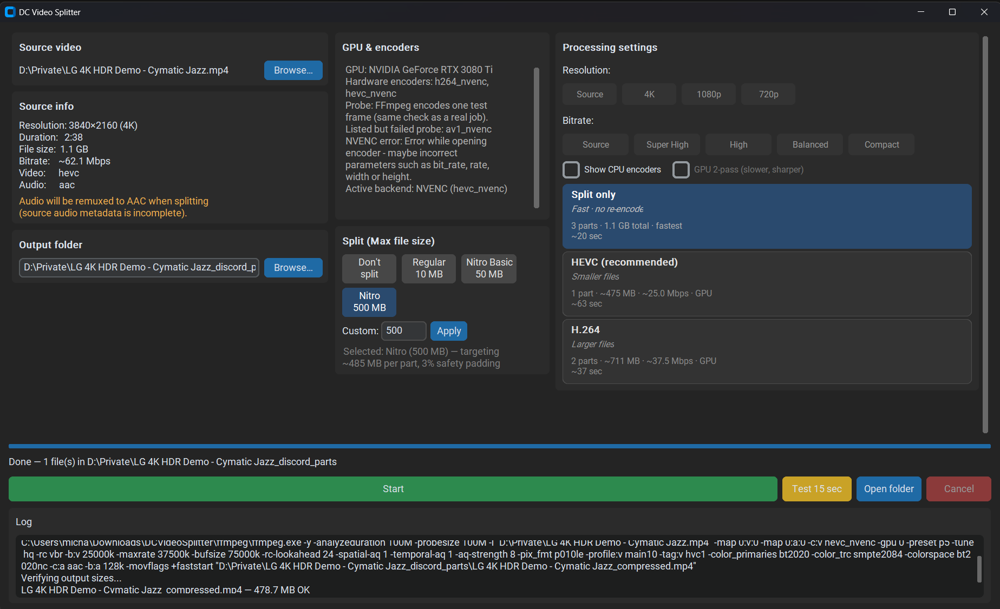

# DC Video Splitter

Split and compress gaming videos for Discord. Pick a file, set a max upload size, and get MP4 clips ready to post.

**Windows only.**

## Screenshot



## Download

Get the latest **release zip** from [GitHub Releases](https://github.com/LightningLdr180/DCVideoSplitter/releases) and unzip the folder anywhere.

Release builds include FFmpeg — you do not need to install it separately. (The source code on GitHub does not include FFmpeg binaries; only the release zip you publish after building does.)

The zip includes:

```
DCVideoSplitter/
  DCVideoSplitter.exe
  ffmpeg/
    ffmpeg.exe
    ffprobe.exe
```

Keep `ffmpeg/` next to the `.exe` — the app needs it to run. If FFmpeg is missing, the app will offer to download it automatically on first launch.

## Windows SmartScreen warning

The first time you run **DCVideoSplitter.exe**, Windows may show a blue **“Windows protected your PC”** screen and list **Unknown publisher**. That is normal for apps distributed without a paid code-signing certificate — it does not mean the file is infected.

To run the app:

1. Click **More info** (if shown)
2. Click **Run anyway**

If you downloaded a zip, you can also right-click it → **Properties** → check **Unblock** → **OK**, then unzip and run again.

Only download releases from the [official GitHub Releases](https://github.com/LightningLdr180/DCVideoSplitter/releases) page.

## How to use

1. Run **DCVideoSplitter.exe**
2. **Browse** for your video
3. Choose a **Discord file size limit** (10 / 50 / 500 MB, or custom)
4. Pick a **processing plan** (split only, HEVC, H.264, AV1, etc.)
5. Click **Start** (or **Test 15 sec** to try a short clip first)
6. Upload the files from the output folder

The app detects your GPU and picks a hardware encoder when possible. Check **GPU & encoders** in the window if something looks wrong.

## Upgrading FFmpeg

FFmpeg is bundled in the `ffmpeg/` folder, not installed system-wide. To use a newer build, download a Windows **gpl** static build from [BtbN FFmpeg Builds](https://github.com/BtbN/FFmpeg-Builds/releases) and replace `ffmpeg.exe` and `ffprobe.exe` in that folder. See [ffmpeg/README.md](ffmpeg/README.md) for details.

## Discord limits (reference)

| Tier | Max upload |
|------|------------|
| Regular | 10 MB |
| Nitro Basic | 50 MB |
| Nitro | 500 MB |

The app targets slightly under your chosen limit so uploads are less likely to be rejected.

## Third-party software

Video processing uses [FFmpeg](https://ffmpeg.org/). FFmpeg is licensed under the GPL; source and license text are available from the FFmpeg project and included builds.
